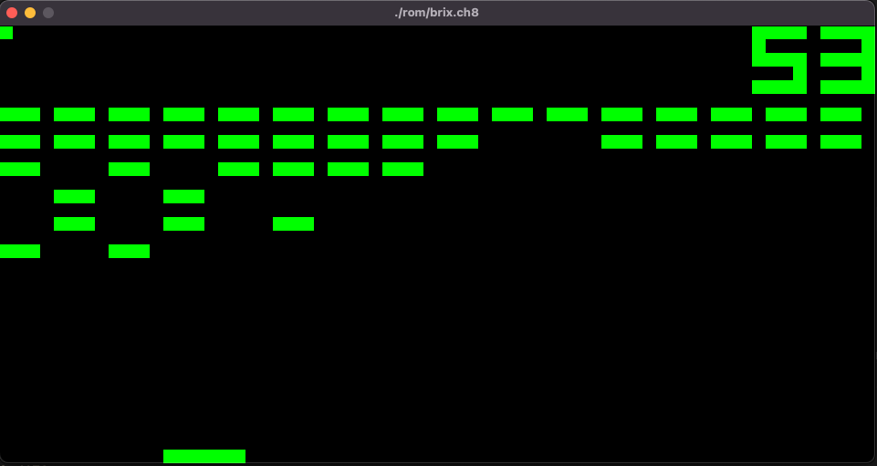
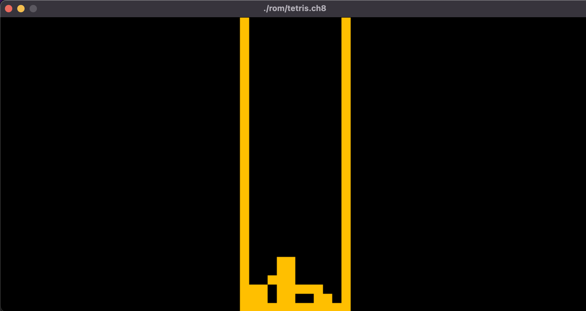

# Chip 8 Emulator 

This is a complete working implementation of chip8 interpreter written in c++.

## Usage

You can use the binary located in the `/build` directory.
The binary requires a room file passed by argument.

E.g: `./build/chip8 <path_to_rom>`

You can use one of the roms located in `/rom1` directory. 
> ./build/chip8 ./rom/brix.ch8

## Build
1. Create makefile using cmake: `cmake .`
2. Create build with: `make`
3. Enjoy it 

### Screenshots 

 

 
